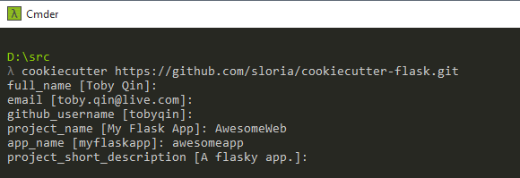
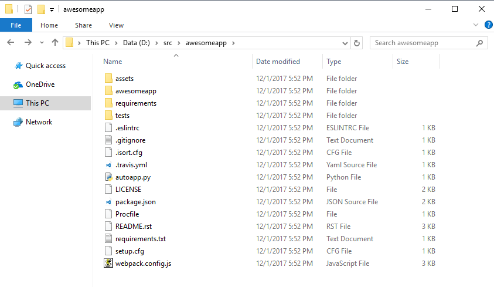

如果快速应用优秀模板或者框架到你的项目？

<!-- more -->

## 简介

Cookiecutter英文的意思大概是饼干模型这么一类东西，可以让你快速做出某种形状的饼干。实际上你在google搜索到的cookiecutter是一个托管在GitHub的开源项目。

-  https://github.com/audreyr/cookiecutter

这是一个就算你不用也应该了解的工具，cookiecutter可以让你快速从各种模板中建立工程，这个项目本身是python写的，但是支持的模板跨越了多种语言和各种领域，看图说话。


## 安装

这是一个命令行工具，需要python支持，所以你要确保python已经正确安装，版本可以是2.x或者3.x。

```
pip install -U cookiecutter
```

## 上手

首先你要确定新建的项目是何种类型，这是一个很严肃的问题。一般IDE会提供新建项目的功能，为什么我们还要cookiecutter？此新建非彼新建。IDE的新建项目一般指的是空项目，而cookiecutter新建的项目一般是已经有一定完成度的框架。

举一个简单例子，你可以从IDE新建一个django项目，新建的项目可以直接运行，但也仅仅是能运行。如果你从cookiecutter新建一个django项目你可以有很多选择，比如是否使用bootstrap，是否集成rest framework，是否要发布到aws，是否使用docker，测试框架使用什么等等。

IDE建房子是从地基开始，cookiecutter可以帮你把架子也搭好。

第一步，确定你要新建的项目类型，假设我要新建一个使用bootstrap的flask项目。从cookiecutter的GitHub页面找到我心仪的模板 （Ctrl + F）。 

第二步，启动命令行，输入 `cookiecutter [template-path/url/zip]`，比如：

```
cookiecutter https://github.com/sloria/cookiecutter-flask.git
```



第三步，按照模板预设的问题一路next，你就新建了一个标准和专业的Flask工程。




## 优点和局限

cookiecutter的主要局限来自于它的优点，太模板化的东西会导致灵活性不足。而且目前可用的各种模板质量参差不齐，不过主流的项目模板都是非常棒的，比如各种前后端框架，机器学习等等，有很多人在维护和更新。

一个框架搭到什么程度比较合适，这就不能一概而论了。

如果你要做一个Django应用，模板里默认就集成了用户注册和登录功能，有时候你觉得太棒了我刚好需要，有时候你觉得我没这样的需求，还得从新建好的项目一点一点删掉没用的代码还可能改错导致跑不起来。

其实我认为cookiecutter也是一个很好的学习渠道，使用cookiecutter新建项目你可以看到别人是如何组织代码，如何管理配置，如何管理依赖等等，比如Python写的项目，理论上你可以把代码扔在任何目录，大拿扔的好看，自己扔的就很丑。

最后再提一点，cookiecutter支持自定义模板，你也可以把自己常用的项目功能打包成模板，后续只要有重用需求，cookiecutter一下，立马开始业务功能的cooding，岂不妙哉？