PyCharm是笔者强烈推荐的Python IDE，如果你有EDU的邮箱可以直接[申请专业版授权](https://betacat.online/posts/2016-09-27/get-jetbrains-student-licence/)，或者就使用社区版，功能上并没有太多缩减，日常开发也完全够用。

<!-- more -->

如果是首次安装PyCharm，有一些设置项建议还是按照自己习惯修改掉，所谓磨刀不误砍柴工。

## 显示工具栏

默认PyCharm并不显示工具栏（Toolbar），在大多数IDE工具栏都放了最常用的操作，你可以通过主菜单-显示-菜单栏来显示工具栏。工具栏显示出来后你还可以通过右键定制上面的按钮，我会把一些跟VCS相关的操作放到上面，比如Fetch，Push，默认它只加了Pull和Commit。

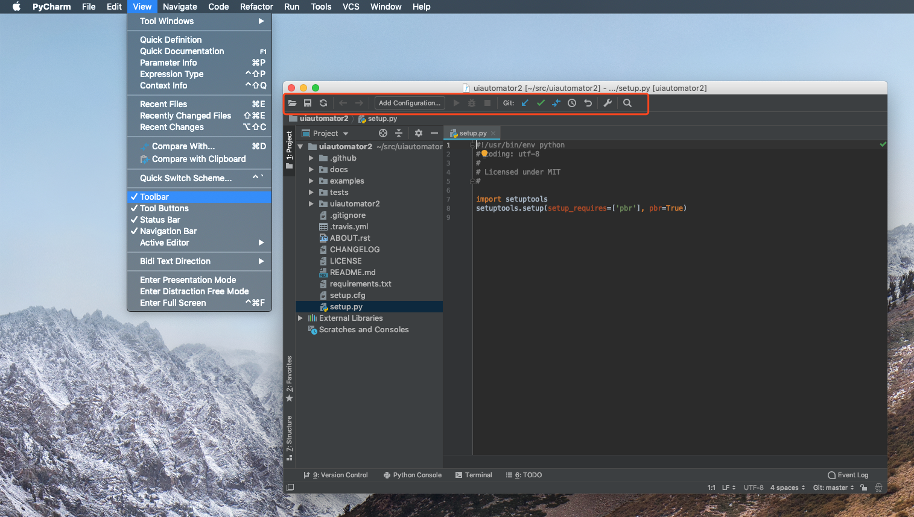

## 智能提示匹配大小写

可能是出于动态语言和性能的考虑，PyCharm的代码提示默认是大小写敏感的。例如你敲`b`会提示你`back`但不会提示你`BACK`，坦白讲挺不方便的，你可以改掉它。在设置里搜索`match case`就可以进行调整。

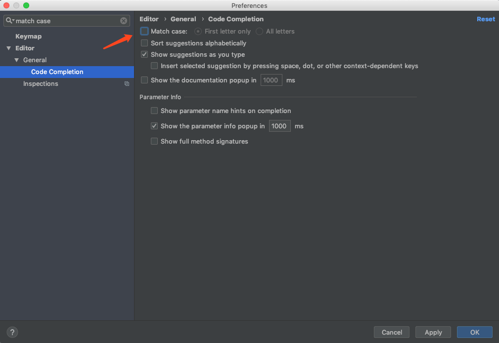

## 鼠标滚轮调整字体大小

有时候我们讨论或者分享代码时，已经设置好的字体大小可能不太合适，很多IDE或者软件都是支持使用鼠标滚轮实时调整字体大小的，PyCharm中你需要手动启用这个功能。在设置中搜索`zoom`就可以找到对应设置项。

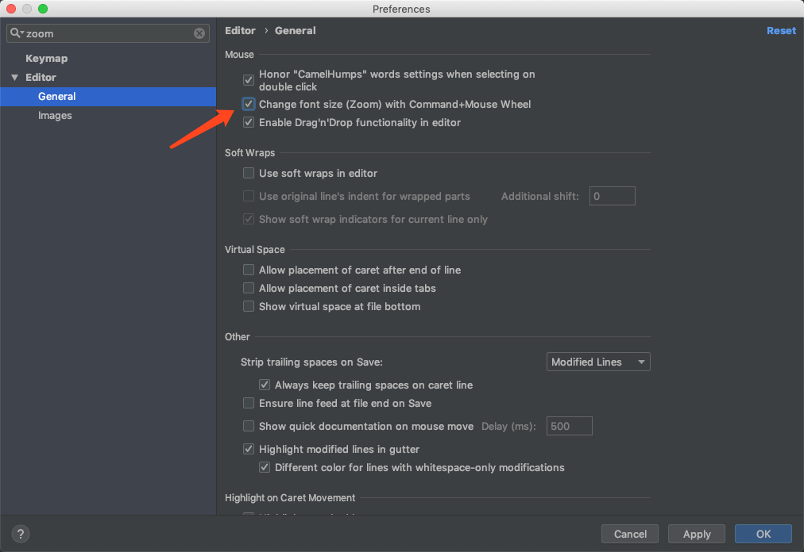

##修改单元测试框架

如果你也有写单元测试的习惯，想必一定知道pytest，PyCharm可以很好地和很多知名的测试框架，但是默认它配置的是unittest，在设置中搜索`test`就可以调整成你常用的框架。

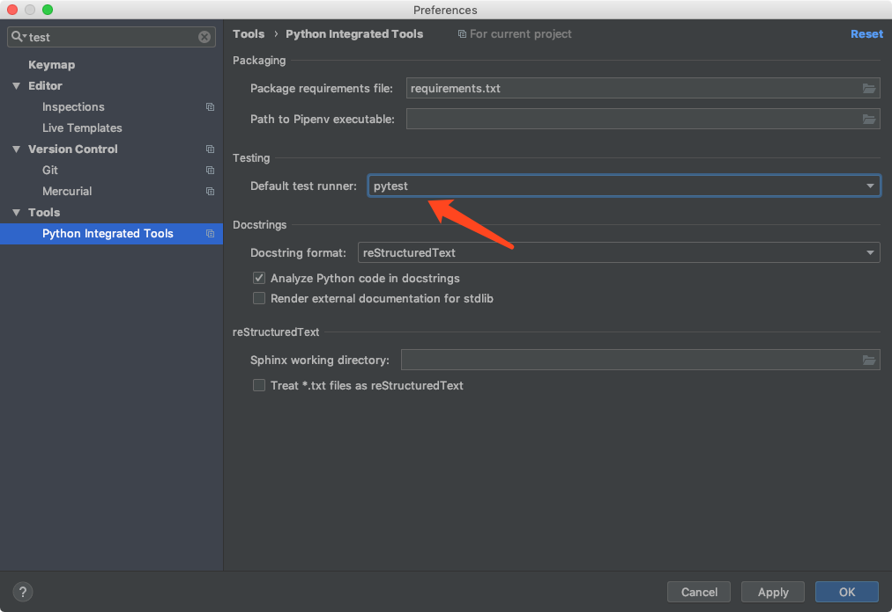

比如调整成pytest之后，只要你的方法名前缀是`test_`，那么IDE就会提示你这是一个test，在前面会多出一个小三角形，让你很方便地运行或者调试。

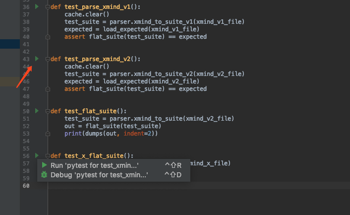

PyCharm支持的测试框架很多，但我喜欢的还是pytest。

顺带一提的是，PyCharm可以自定义的类似配置还有很多，比如terminal使用的shell，虚拟环境选用的工具，Flask模板语言等等。

## 提交代码前的选项

假设你已经默认显示工具栏，那么以后你提交代码只需要点击工具栏里的Commit按钮即可，这时候会弹出一个对话框，你在这里可以很方便地看到你要提交的文件，可以随意diff，add, remove甚至直接edit。很多时候我们在diff时发现有些旮旯里总漏点东西，一般的流程时关掉diff，回到编辑器，找到那个地方改掉，在PyCharm这个提交对话框，你可以一气呵成，爽歪歪。

更厉害的是，你还可以选择提交前格式化代码，优化import区等等。

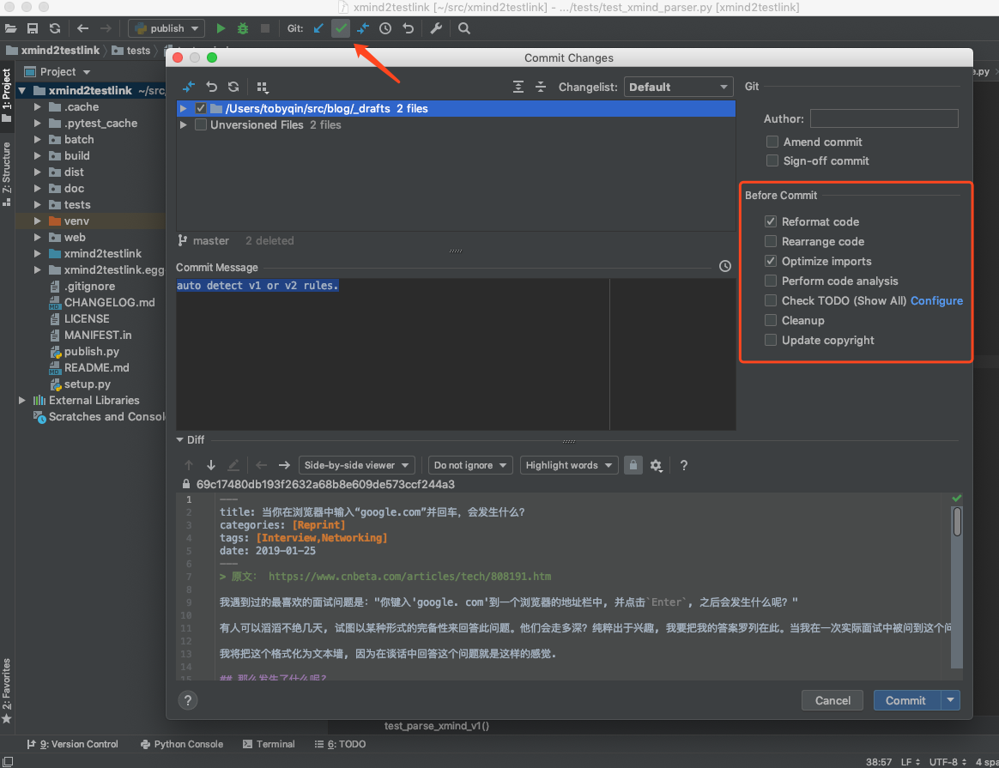

## 其他可以调整的设置

1. 外观和主题，包括编辑器字体，背景等等。
2. 快捷键，如果你记不住它默认的快捷键，那么就改成你能记住的。
3. 隐藏某些项目文件，治愈强迫症患者。（设置中搜索“ignore files”）
4. 安装自己顺手的插件。（设置中搜索“plugins”）

## 一些使用心得总结

**内置的VCS很好用**

内置的Version Control提供了日常操作需要的所有功能，而且触手可及，关键是非常直观，用过之后欲罢不能。它还提供了changlist和shelvset功能，让你在合并或者提交代码前暂存不想处理的修改，这是很多开发者都想要的功能。

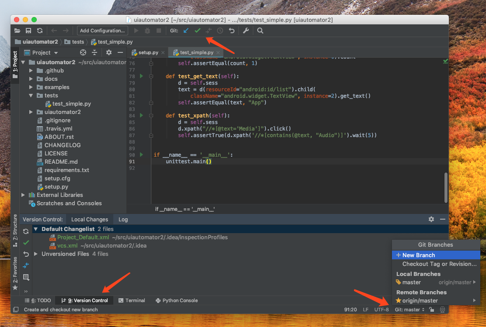

**内置的命令行工具很好用**

IDE内置命令行工具其实是一个硬需求，你看现在，几乎你找不到一个不带命令行的IDE。PyCharm带的IDE最方便的地方在于，可以自动识别项目里的虚拟环境并启用它，这是外部命令行工具没法比拟的。

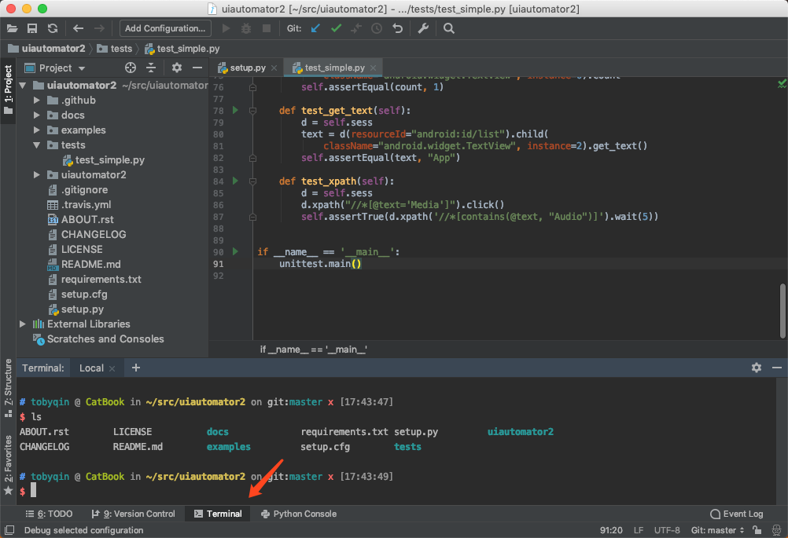

**内置的Python Console很好用**

写Python肯定是离不开即时解释器的，在PyCharm里你随手就可以用Python Console测试代码片段，它不仅提供了智能提示，还可以查看运行中的变量，甚至还能绘图画表，集成iPython Notebook。

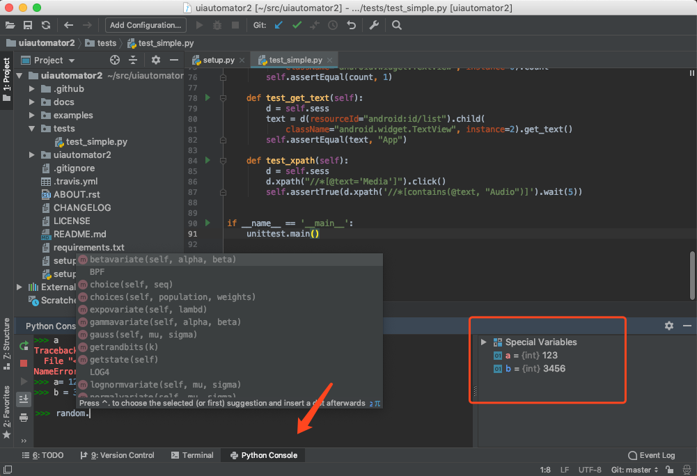

**修改运行时状态很爽**

当你用PyCharm调试代码时，可以直接在Variables窗口看到运行变量，也可以直接修改这些变量的值，更厉害的是，你可以直接执行语句，点那个计算器一样的图标就行。

这个功能Visual Studio里也有，叫ImmediateWindow，可以节约你大把的调试时间。然而PyCharm少了一个Visual Studio里我非常喜欢的功能，拖拽当前断点。假设当前断点停在第40行，VS里可以直接拖到前面几行，例如第30行，人为控制这块代码反复运行。

**总是为新项目建立虚拟环境**

千万不要只用默认的Python环境写多个项目，2个也不行，以后你会后悔的。如果你能真的确定这台机器的Python只跑一个项目，那你可以不用虚拟环境。在PyCharm建立一个新的虚拟环境只需要点几下，不麻烦的。

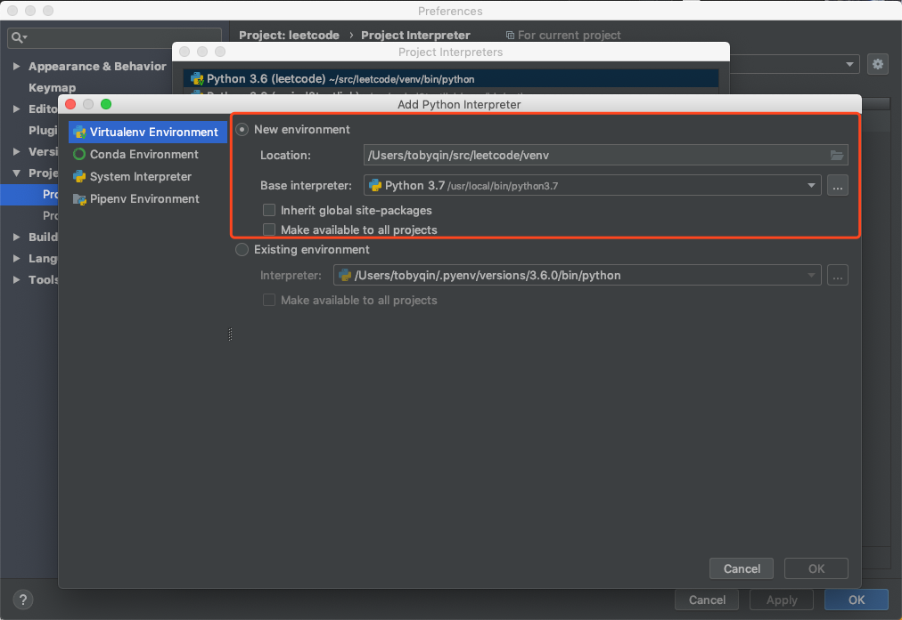

**导入导出配置最靠谱**

前面我们说了很多配置选择，如果你有N台机器都安装了PyCharm，每台都重新配置一遍多累啊，特别是快捷键如果不用默认的，换机器都想哭。

PyCharm提供了一个同步配置的方案，你可以新建一个空的git repo，填到 Tools / Settings / Repository 里就可以自动上传配置。别的机器也同样配置一样，理论上配置就云同步了。但是我亲身体验告诉你，这个真不靠谱，Mac和Windows多倒腾几次就错乱了，想哭啊。还好我有方案B。

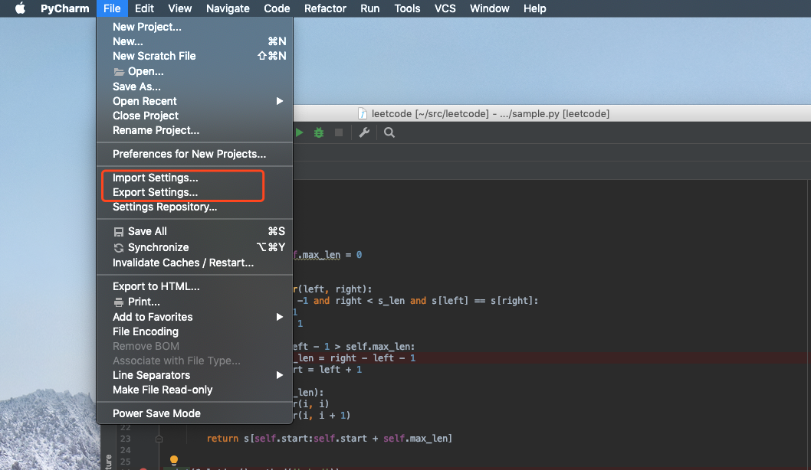

方案B很简单，在某一台机器配置好后，选择主菜单 - 文件 - 导出配置。导出的配置是一个jar文件，随便扔到印象笔记或者坚果云里，新机器里用主菜单 - 文件 - 导入配置即可。

**专业版和社区版的区别**

刚好两个版本我都在用，大概说说专业版多出来可能会用到的东西。

1. 和Flask，Django深度集成，智能提示到你惊讶的级别。
2. 支持调试多线程，提供性能优化工具。
3. 快速获得和显示单元测试覆盖率。
4. 集成数据库工具，可以在IDE里直接连接任何数据库。
5. 支持Live Edit，让你在编辑代码同时，实时在浏览器中展示。
6. 支持一键部署docker。

专业版还是很厉害的，不过也很贵。多出来的功能挺方便，但也不是必须的，大家可以酌情选择。

最后，祝大家happy coding。